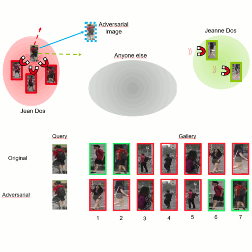

# Vulnerability of Person Re-Identification Models to Metric Adversarial Attacks

## Thank you for your interest in our work

Please refer to this repository for the full source code: https://github.com/CEA-LIST/adv-reid 

It contains the reference source code for the paper [Vulnerability of Person Re-Identification Models to Metric Adversarial Attacks](http://openaccess.thecvf.com/content_CVPRW_2020/papers/w47/Bouniot_Vulnerability_of_Person_Re-Identification_Models_to_Metric_Adversarial_Attacks_CVPRW_2020_paper.pdf) (CVPRW'20). For more information, please check out our paper and our presentation : https://www.youtube.com/watch?v=X0YRPxzOMR0. 

As classification attacks are not applicable to re-identification, we propose different possible attacks on metric learning models depending on the number and type of guides available. Two particularly effective attacks stand out. To defend against these attacks, we adapt the adversarial training protocol for metric learning. Let us guide you !



# Citation

If you find this useful for your own work, please cite our paper:
```BibTeX
@InProceedings{Bouniot_2020_CVPR_Workshops,
  author = {Bouniot, Quentin and Audigier, Romaric and Loesch, Angélique},
  title = {Vulnerability of Person Re-Identification Models to Metric Adversarial Attacks},
  booktitle = {The IEEE/CVF Conference on Computer Vision and Pattern Recognition (CVPR) Workshops},
  month = {June},
  year = {2020}
}
```
